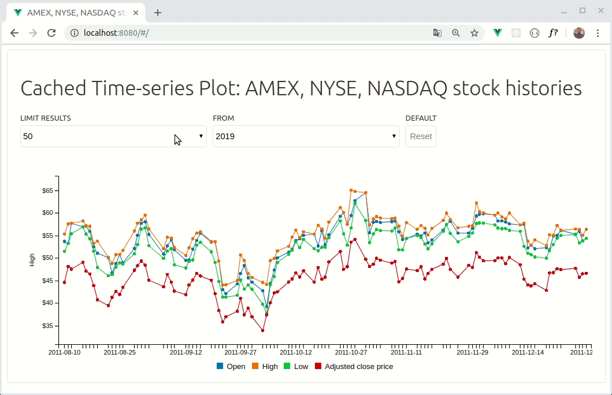

# Stock History

Is a web application written in Vuejs, that uses [C3.js](https://c3js.org) (D3.js) to display a time-series chart of the stocks history from AMEX, NYSE, and NASDAQ since 1970.



## Project setup
```
npm install
```

### Compiles and hot-reloads for development
```
npm run serve
```

### Compiles and minifies for production
```
npm run build
```

### Run your tests
```
npm run test
```

### Lints and fixes files
```
npm run lint
```

### Run your unit tests
```
npm run test:unit
```

### Customize configuration
See [Configuration Reference](https://cli.vuejs.org/config/).

## License 

MIT License - [Firmino Changani](https://github.com/flowck)